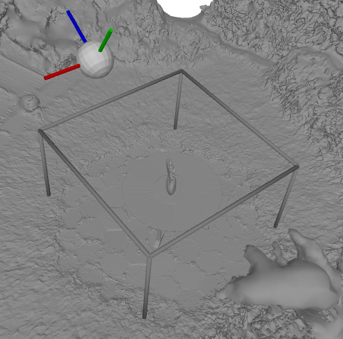

# NeRF data preparation from real-world images 

This repo is used to transform real-world images to the form that needed by our paper [Cicero: Real-Time Neural Rendering by Radiance Warping and Memory Optimizations](), it includes five steps:
- use [Metashape](https://www.agisoft.com/) to reconstruct mesh and camera poses from real world data
- post-processing the mesh by cropping out the region of interests
- use the cropped mesh to generate foreground mask and depth maps of images
- transform the metashape data to blender dataformat that is compatible with three methods used in our paper
- tune the parameters for real-world dataset in three methods and get the final result.

## 1. Use metashape to generate mesh and camera poses from real world data.

### Download the software and set it up. There is a one month free trial.
### Reconstruct the camera poses mesh following their [Manual](https://www.agisoft.com/pdf/metashape_2_1_en.pdf)
- This step mainly include two steps: (1) align photos (2) Create model (mesh)
    - align photos: we use default setting
    - Create model (mesh): we change quality to high 
- after this step, export the model (mesh in .obj format) and cameras parameters (include extrinsicts and intrinsicts) to a folder. The folder should looks like below. mesh.obj and mesh.mtl is from mesh, and meta.xml describe the camera extrinsicts and intrinsicts.
```
.
├── mesh.mtl
├── mesh.obj
└── meta.xml
```

## 2. Post-processing the mesh by cropping out the region of interests
 Due to sparse sampling, metashape can't reconstruct background mesh well, it well cause holes or inaccuracy in depth maps, so here we crop out the foreground mesh that we care. During the experiences of Cicero, we only render pixels, computing PSNR and sparsity in the foreground. This step has two stages, first you need to decide the foreground bounding box, then you need to process the whole mesh to filter out faces outside of the bounding box.

 ### Decide the foreground bounding box

 use following script to visualize bounding box and mesh, adjust the bounding box to 
 make it contain the forground, use the coordinate drawn in the viewer to help you adjust it.
 ```bash
 python3 bounding_box_drawer.py --input_mesh <path_to_mesh.obj> --bbox <path_to_bbox.txt>
 # ex: python3 bounding_box_drawer.py --input_mesh ../garden/mesh.obj --bbox ./garden_bbox.txt
 # see crop_foreground/garden_bbox.txt to know how to write bbox.txt
 # cx, cy, cz are centers
 # rx, ry, rz are rotation in degrees
 # lx, ly, lz are lengths of the bbox
 ```
 here is an example of adjusted bbox in garden scene:
<p float="left">
  
</p>

 ### Filter out the back ground mesh outside the bounding box
 After setting the foreground region, we need to filter out the background meshes, and during our evaluation, those pixels correspond to no mesh (background pixels) won't be counted.
 run below code to filter out the background mesh:
```bash
python3 background_mesh_filter.py --input_mesh <path_to_origin_mesh.obj> --output_path <path_to_save_cut_mesh.obj> --bbox <path_to_bbox.txt> --num_workers 16
# ex: python3 background_mesh_filter.py --input_mesh ../garden/mesh.obj --output_path ../garden/mesh_cut.obj --bbox garden_bbox.txt --num_workers 16
```
After the filtering, pyrender viewer will show the bounding box and cropped result like below:
<p float="left">
  
</p>
