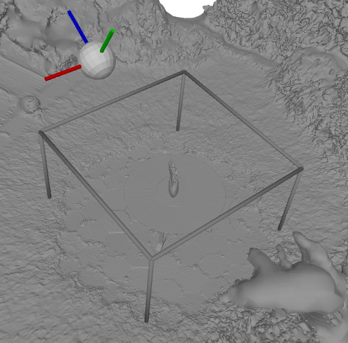
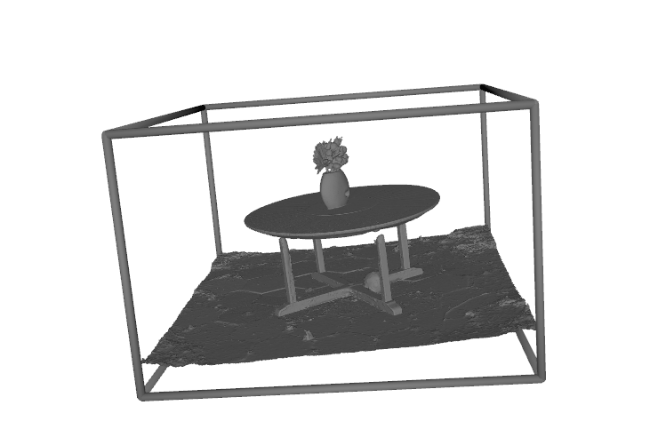
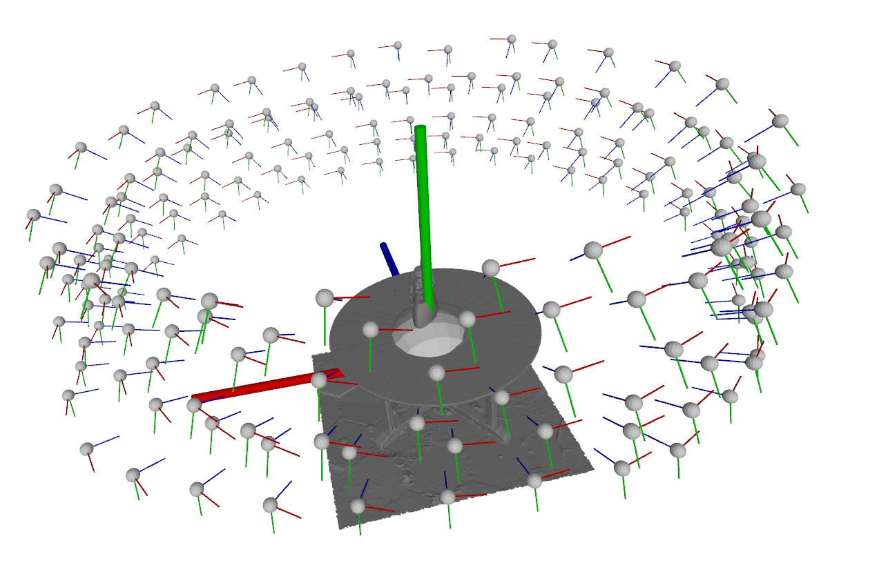
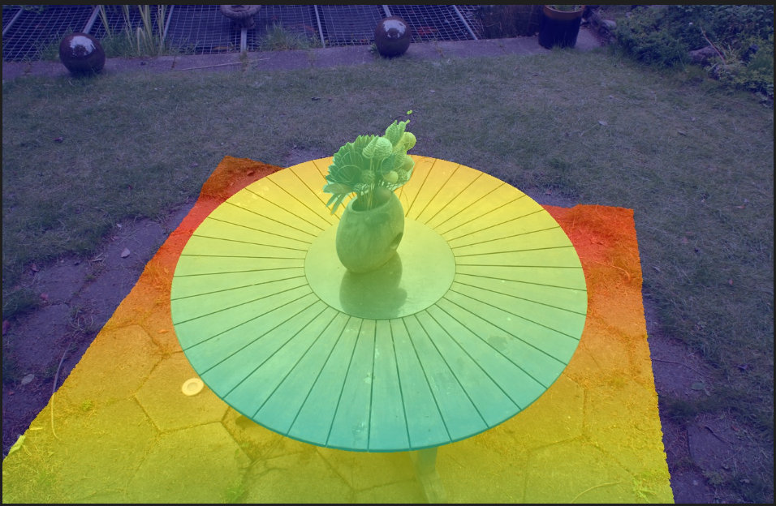
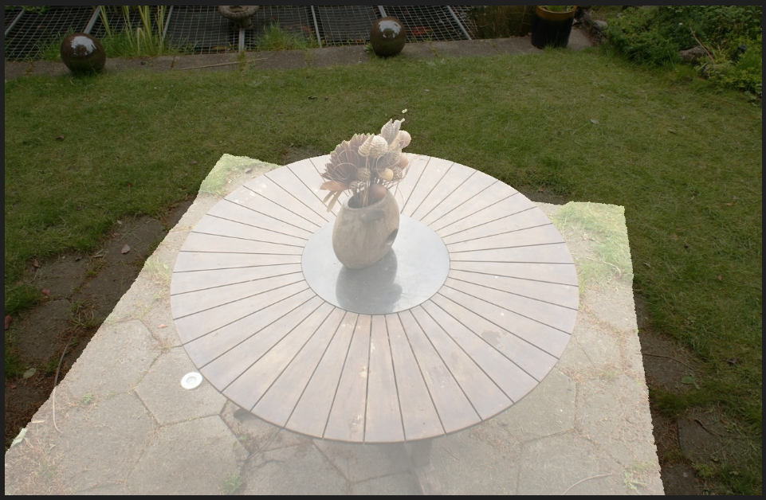

# NeRF data preparation from real-world images 

This repo is used to transform real-world images to the form that needed by our paper [Cicero: Real-Time Neural Rendering by Radiance Warping and Memory Optimizations](), it includes five steps:
- Use [Metashape](https://www.agisoft.com/) to reconstruct mesh and camera poses from real world data
- Post-processing the mesh by cropping out the background
- Use the cropped mesh to generate foreground mask and depth maps of images
- Transform the metashape data to blender dataformat that is compatible with three methods used in our paper
- Tune the parameters for real-world dataset in three methods and get the final result.

## 1. Use metashape to generate mesh and camera poses from real world data.

### (1.1) Download the software and set it up. There is a one month free trial.
### (1.2) Reconstruct the camera poses mesh following their [Manual](https://www.agisoft.com/pdf/metashape_2_1_en.pdf)
- This step mainly include two steps: (1) align photos (2) Create model (mesh)
    - align photos: we use default setting
    - Create model (mesh): we change quality to high 
- after this step, export the model (mesh in .obj format) and cameras parameters (include extrinsicts and intrinsicts) to a folder. The folder should looks like below. mesh.obj and mesh.mtl are from mesh, and meta.xml describe the camera extrinsicts and intrinsicts.
```
.
├── mesh.mtl
├── mesh.obj
└── meta.xml
```

## 2. Post-processing the mesh by cropping out the background
 Due to sparse sampling, metashape can't reconstruct background mesh well, it well cause holes or inaccuracy in depth maps, so here we delete the background mesh that we don't care. During the experiments, we only computing sparsity in the foreground. 
 This step has two stages, first you need to decide the foreground bounding box, then you need to process the whole mesh to filter out faces outside of the bounding box.

 ### (2.1) Decide the foreground bounding box

 use following script to visualize bounding box and mesh, adjust the bounding box to 
 make it contain only the forground, use the coordinate drawn in the viewer to help you adjust it.

 A good bounding box should: 
 - contain only the foreground.
 - contain the foreground using size as small as possible.
 ```bash
 cd crop_foreground
 python3 bounding_box_drawer.py --input_mesh <path_to_mesh.obj> --bbox <path_to_bbox.txt>
 # eg. python3 bounding_box_drawer.py --input_mesh ../garden/mesh.obj --bbox ./garden_bbox.txt
 # see crop_foreground/garden_bbox.txt to know how to write bbox.txt
 # cx, cy, cz are centers
 # rx, ry, rz are rotation in degrees
 # lx, ly, lz are lengths of the bbox
 ```
 here is an example of adjusted bbox in garden scene:
<p float="left">
  
</p>

 ### (2.2) Filter out the back ground mesh outside the bounding box
 After setting the foreground region, we need to filter out the background meshes, and during our evaluation, those pixels correspond to no mesh (background pixels) won't be counted.
 run below code to filter out the background mesh:
```bash
 cd crop_foreground
python3 background_mesh_filter.py --input_mesh <path_to_origin_mesh.obj> --output_path <path_to_save_cut_mesh.obj> --bbox <path_to_bbox.txt> --num_workers 16
# eg. python3 background_mesh_filter.py --input_mesh ../garden/mesh.obj --output_path ../garden/mesh_cut.obj --bbox garden_bbox.txt --num_workers 16
```
After the filtering, pyrender viewer will show the bounding box and cropped result like below:
<p float="left">
  
</p>


# 3. Normalize Camera poses and Mesh and Fix the Camera poses
Since some methods may expect foreground to be at origin and have small size, here we need to normalize the camera poses and mesh using the bounding box information in case some of them have no auto-detection and normalizion.
## (3.1) Parse the metashape data
run:
```bash
cd norm_and_fix_data
python3 parse_cameras_meta.py --meta_file <path_to_meta.xml> --output_path <path_to_save_parsed_meta.pkl>
# eg. python3 parse_cameras_meta.py --meta_file ../garden/meta.xml --output_path ../garden/parsed_meta.pkl
```
## (3.2) Normalize Mesh and Camera Poses using BBox information

In this stage we normalize the foreground to 1x1x1 bounding box around origin using the foreground bounding box information.
run:
```bash
python3 norm_poses_mesh.py --parsed_meta ../garden/parsed_meta.pkl --input_mesh ../garden/mesh_cut.obj --output_mesh_path ../garden/norm_mesh.obj --output_meta_path ../garden/norm_meta.pkl
```
Then you will see a visualization windows shows the normalized results like below, make sure postive z-axis (blue) is pointed to the target and mesh is alighed with the axis in the same way as it aligh with the foreground bounding box. 
<p float="left">
  
</p>

## (3.3)  Fix the camera pose by rotate it
Since camera in pyrender and blender format data all target the object using negative z-axis which is different from metashape, we need to rotate it here.
run:
```bash
python3 fix_poses.py --in_meta ../garden/norm_meta.pkl  --output_path ../garden/fix_norm_meta.pkl
```


# 4. Use the cropped mesh to generate foreground mask and depth maps of images from mesh

## (4.1) Get depth and foreground mask from mesh 
Run below code. Since we are testing 4x downsampled dataset, we set downsampled_factor to 4.
The depth map is fp32 and will be named according to the corresponding image, and the mask is computed using depth>0, saved in np.uint8 format, also named according to the corresponding image.
```bash 
cd generate_depths_and_mask
python3 get_depth_and_mesh.py --cut_mesh <path_to_cut_mesh.obj> --parsed_meta ../garden/<path_to_parsed_meta.pkl> --downsampled_factor 4 --output_folder <path_to_save_output.npy>
# eg. python3 get_depth_and_mesh.py --cut_mesh ../garden/norm_mesh.obj --parsed_meta ../garden/fix_norm_meta.pkl --downsampled_factor 4 --output_folder ../garden/depths_masks_4
```

## (4.2) Validate the gernerated depth and mask
To validate the depth and mask, we can overlap them with RGB image.
run:
```bash
cd generate_depths_and_mask
python3 validate.py --depth_masks_folder <path_to_depths_and_masks> --rgb_folder <path_to_rgb_images> --output_folder <path_to_save_output_overlapped_images>
# eg. python3 validate.py --depth_masks_folder ../garden/depths_masks_4/ --rgb_folder ../garden/images_4/ --output_folder ../garden/depth_mask_validation
```
output will look like: (left is depth validation image, right is mask validation image.)
<p float="left">
  
  
</p>


# 5. transform the metashape data to blender dataformat that is compatible with three methods used in our paper

## (5.1) Generate RGBA format masked image 
We use A=0 to tell the background pixels, same as blender dataset
run:
```bash
python3 generate_mask_image_set.py --depth_masks_folder ../garden/depths_masks_4/ --rgb_folder ../garden/images_4/ --output_folder ../garden/images_4_mask
```


## (5.2)
run below code.Since I have normalize the data, aabb_scale=1 works fine in my case. And I use downscale_factor=4 which will be applied to camera intrinsicts.
```bash
cd gnerate_blender_format
bash ./gnerate_blender_format.sh <aabb_scale> <path_to_parsed_meta.pkl> <json_output_folder> <img_folder> <downscale_factor>
# modified from colmap2nerf in https://github.com/NVlabs/instant-ngp
# eg. bash ./gnerate_blender_format.sh 1 ../garden/fix_norm_meta.pkl ../garden/ ../garden/images_4_mask/ 4.0
```
You shoud see "transforms_xxx.json" under the output_folder now.

Here is how my ```garden/``` folder look like after this step:
```
.
├── depth_mask_validation/
├── depths_masks_4/
├── images_4/
├── mesh_cut.obj
├── mesh.mtl
├── mesh.obj
├── meta.xml
├── parsed_meta.pkl
├── transforms_test.json
├── transforms_train
├── transforms_train.json
└── transforms_val.json
```

# 5. tune the parameters for real-world dataset in three methods and get the final result.

The three methods we use in the paper include:
- [Instant NGP](https://github.com/NVlabs/instant-ngp)
- [DirectVoxGO](https://github.com/sunset1995/DirectVoxGO)
- [TensoRF](https://github.com/apchenstu/TensoRF)

Since we are using our own dataset constructed by metashape, we need to do two things:
- Integrate our blender format data into three methods.
- tune parameters by ourselve, mainly the bounding box of nerf algorithm.

Here I will introduce the integration method and tuning results.

## Instant NGP
### clone and set up their code. (see their repo)
```bash
git clone https://github.com/NVlabs/instant-ngp
git submodule update --init --recursive
xhost +
cmake ./ -B ./build -DCMAKE_BUILD_TYPE=RelWithDebInfo
cmake --build build --config RelWithDebInfo -j 32
```

### For Instant NGP, setting is as follow:
- our data is directly usable, we only need to tune the aabb scale metioned in step4, I set it to be 16 in step4.

- need to change line 284 to fix problem:
```python
284. # cam_matrix = f.get("transform_matrix", f["transform_matrix_start"])
285. cam_matrix = f["transform_matrix"]
```
### Below is the training / Evaluation code we use


Note: We can increase network capacity to improve PSNR  but in order to stay consistent with our hardware evaluation for sythetic NeRF, we use default setting.

```bash
# training
cd scripts/
python3 run.py ../configs/nerf/base.json --scene ../../../garden/transforms_train.json --save_snapshot ../../../garden/ingp_256_35000_base.ingp --marching_cubes_res 256 --n_steps 35000

# testing and save snapshots of val set
python3 run.py --scene ../../../garden/transforms_train.json --load_snapshot  ../../../garden/ingp_256_35000_base.ingp --test_transforms ../../../garden/transforms_val.json --screenshot_transforms ../../../garden/transforms_val.json --screenshot_dir ../../../garden/ingp_256_35000_base_snapshots --marching_cubes_res 256

# testing and save snapshots of training set
python3 run.py --scene ../../../garden/transforms_train.json --load_snapshot  ../../../garden/ingp_256_35000_base.ingp --test_transforms ../../../garden/transforms_train.json --screenshot_transforms ../../../garden/transforms_train.json --screenshot_dir ../../../garden/ingp_256_35000_base_snapshots --marching_cubes_res 256
```


## DirectVoxGO

## Clone and set up their code. (see their repo)
```bash
git clone https://github.com/sunset1995/DirectVoxGO
```

For DorectVoxGo, they have special``` dcvgo.DirectContractedVoxGO ``` for unbounded scene, but in order to stay consistent with our hardware evaluation for sythetic NeRF, we use same setting as sythetic NeRF.You can enable the ``` dcvgo.DirectContractedVoxGO ```  by setting ```unbounded_inward=True```, check their config file for unbounded 360.

Also before running with our configuration, you need to add below code to  ```DirectVoxGO/lib/load_data.py``` line 134
since the ```near, far``` in our scene should be larger than sythetic-NeRf

```python
    elif args.dataset_type == 'metashape':
        images, poses, render_poses, hwf, i_split = load_blender_data(args.datadir, args.half_res, args.testskip)
        print('Loaded blender', images.shape, render_poses.shape, hwf, args.datadir)
        i_train, i_val, i_test = i_split

        near, far = 0.1, 256

        if images.shape[-1] == 4:
            if args.white_bkgd:
                images = images[...,:3]*images[...,-1:] + (1.-images[...,-1:])
            else:
                images = images[...,:3]*images[...,-1:]  
```

Also, we need to change the line 57 in load_blender to meet our image name:
```python
            # fname = os.path.join(basedir, frame['file_path'] + '.png')
            fname = os.path.join(basedir, frame['file_path'])
```

Put our ```networks_config/DirectVoxGO/metashape.py``` under ```DirectVoxGO/configs```, then you can run the training code:

```bash
python3 run.py --config configs/metashape.py --render_test
```
garden_0_2_long is fine with 30.43 psnr, use default for all?
We can increase network capacity to improve PSNR  but in order to stay consistent with our hardware evaluation for sythetic NeRF, we use default setting.

## TensoRF

python3 train.py --config configs/metashape.txt

line 71:

            # image_path = os.path.join(self.root_dir, f"{frame['file_path']}.png")
            image_path = os.path.join(self.root_dir, f"{frame['file_path']}")

/home/lwk/ur_research/mesh_proj/NeRFDataPrep/three_methods/TensoRF/dataLoader/__init__.py
/home/lwk/ur_research/mesh_proj/NeRFDataPrep/three_methods/TensoRF/dataLoader/metashape.py
/home/lwk/ur_research/mesh_proj/NeRFDataPrep/three_methods/TensoRF/configs/metashape.txt
/home/lwk/ur_research/mesh_proj/NeRFDataPrep/three_methods/TensoRF/opt.py

 31.70 (setting1)
 
## Results 

- PSNR (val, train)

    | split \ dataset | 360-Garden | Tanks&Temple-Ignatius |
    |----------|----------|----------|
    | Instant NGP | (21.97, 23.88) | Row1 Col3 |
    | DirectVoxGo   | 23.88 | Row2 Col3 |